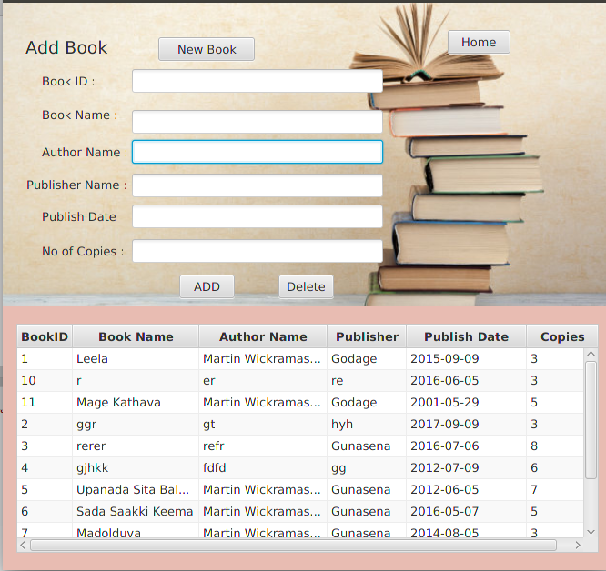
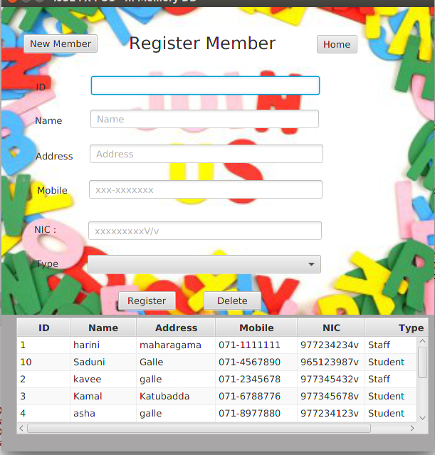
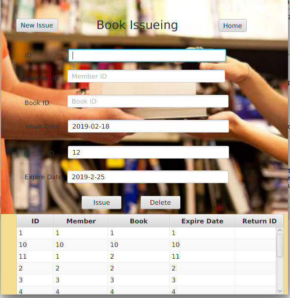
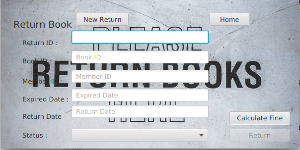
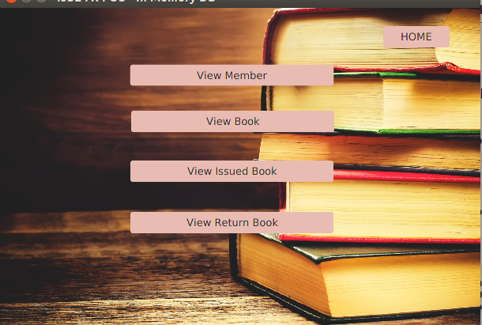

# **Library Management System** <h1>

      
Library Management System heps to handle the proccess of the libarary easily.

   
 <ul>
    <li>By selecting Add Book out of the main operations show in the image, Librarian can add a book for the database.All the data will be stored in the MYSQL database.Librarian wants to give book's details,Author details and publisher details with an ID to add a new bokk.ID should be unique for each book.</li>
</ul>

<ul>
    <li>By selecting Add Member out of the main operations show in the image, Librarian can add a member for the database.Librarian wants to give member's details,member type(student/staff) with an ID to register a new member.ID should be unique for each member.</li>
</ul>
                                
  

<ul>
    <li>By selecting Issue Book out of the main operations show in the image, Librarian can issue more than one book to a particular member.Librarian should give details about issued books.Issue ID should be unique at each time when issuing a book.Also automatically generate a return id for each issued book.</li>
</ul>                            
                                
   

<ul>
    <li>By selecting Return Books out of the main operations show in the image,Librarian can get issued details of a particular book by input the return id of that book.After that system will automatically generate the fine before return the book. </li>
</ul>                            
                                
     

<ul>
     <li>By selecting View Details out of the main operations show in the image, Librarian can view member,books, issued books, and returned books.Also Librarian can search all that details by their Ids or name.</li>
</ul>                        
                               
                             
                         
